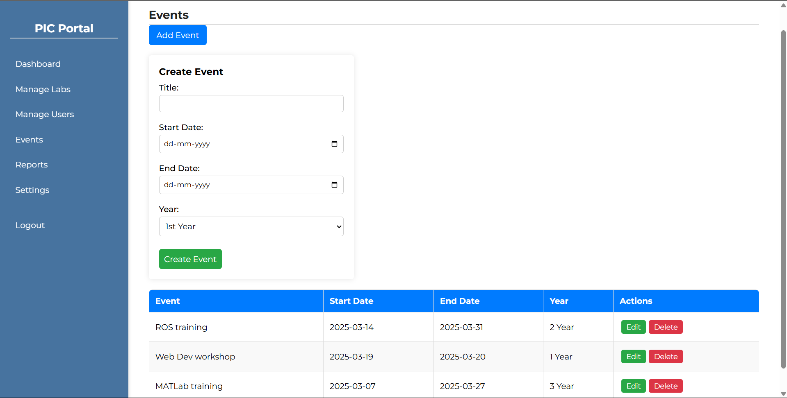
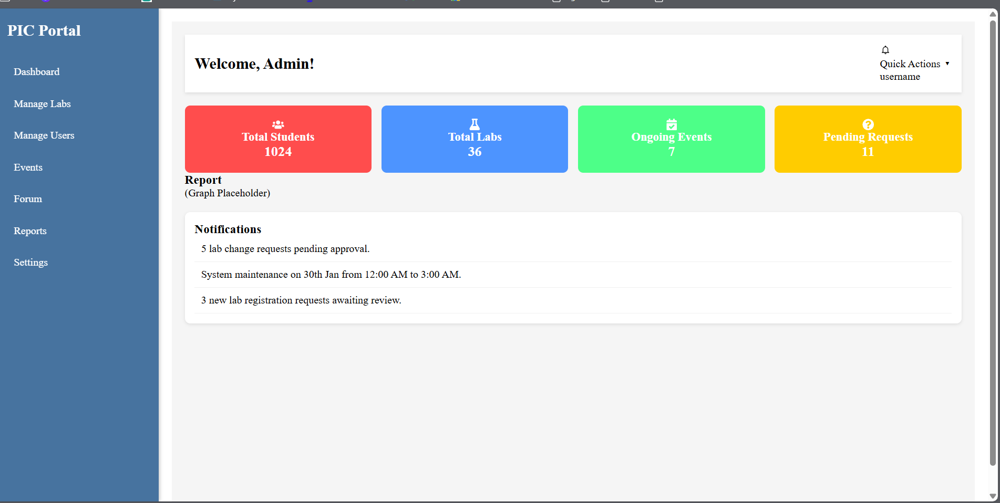
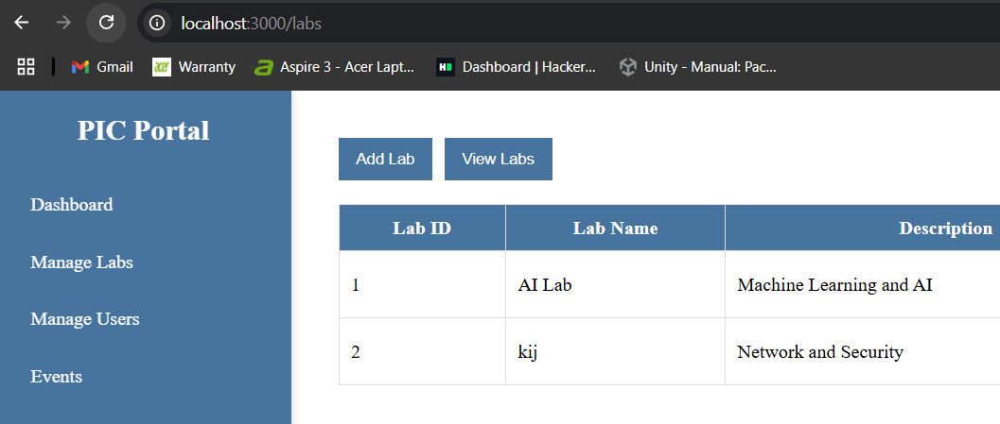
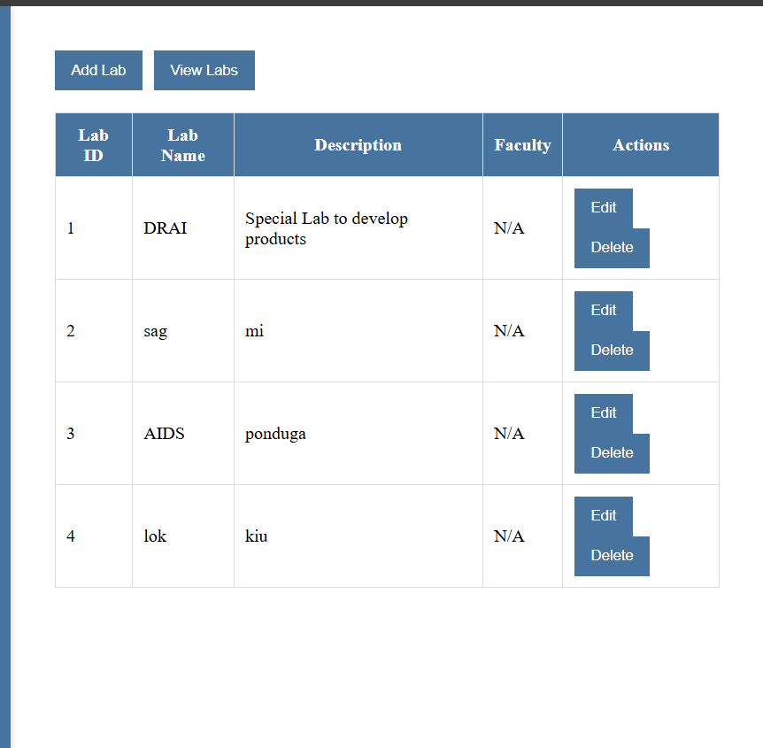
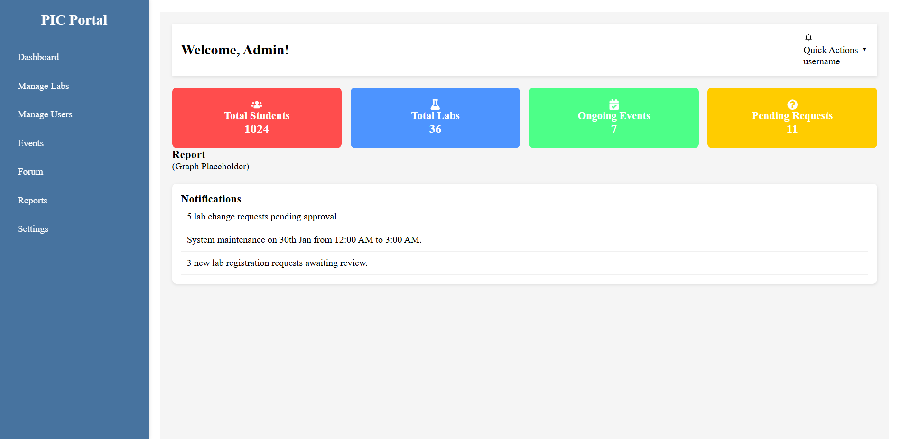
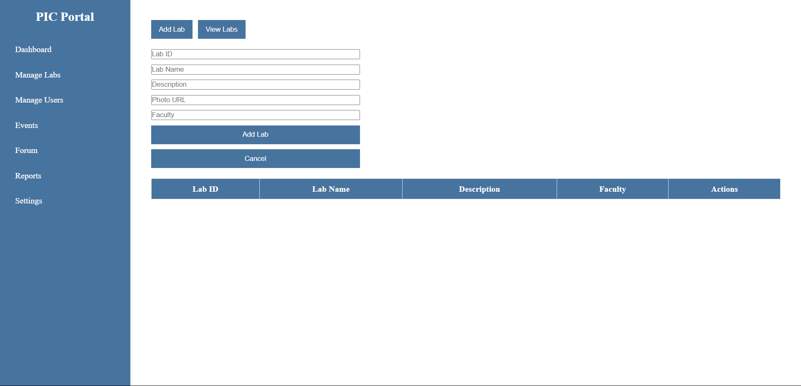
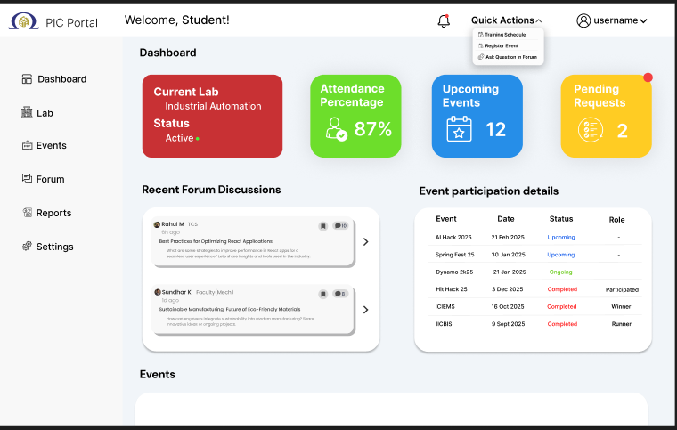

# 🧪 LabConnect – Role-Based Lab Portal

**LabConnect** is a full-stack role-based portal designed for managing lab registrations, attendance, and discussions inside a **Product Innovation Center (PIC)**. Built with a frontend in **ReactJS** and backend in **Spring Boot**, the application provides seamless interactions among **Students**, **Faculty**, **Industry Experts**, and **Admins**.

---

## 🚀 Key Features

- **Role-based access** for Admin, Faculty, Student, and Industry Person
- Admin can **create labs**, manage events, assign users, and perform full **CRUD operations**
- Faculty can **approve/reject requests**, give attendance, and manage discussions
- Students and Industry persons can **collaborate** through a built-in **discussion forum**
- Real-time, low-latency operations via **Spring Boot + MySQL** backend
- Connected via **Ngrok URLs** for seamless development testing

---

## 🛠️ Tech Stack

- **Frontend:** ReactJS, React Hooks, CSS
- **Backend:** Spring Boot
- **Database:** MySQL
- **API Handling:** Axios + Ngrok Integration

---

## 📸 UI Screenshots

### 🔐 Login Page

---

### 📊 Dashboard Page

---

### 🗓️ Attendance Page

---

### 💬 Discuss Forum Page

---

### 📝 Lab Register & Change Page (Student)

---

### 📥 Requests Page (Faculty)

---

### 🧾 Labs Page (Admin)

---

## 💡 What This Project Solves

This portal removes the hassle of manual lab registration and communication by offering a **centralized, scalable, and interactive** web-based solution tailored to academic and innovation centers.

---

## 👨‍💻 Authors

**Sanjay** – Frontend Developer  
ReactJS • Web Architecture

**Ravi Varma** – Backend Developer  
Spring Boot • Database • Problem Solving

**Sutharshan** – UI/UX  
Figma • Canva 

**Vijay Anand** – API handling  
API • Ngrok

---

